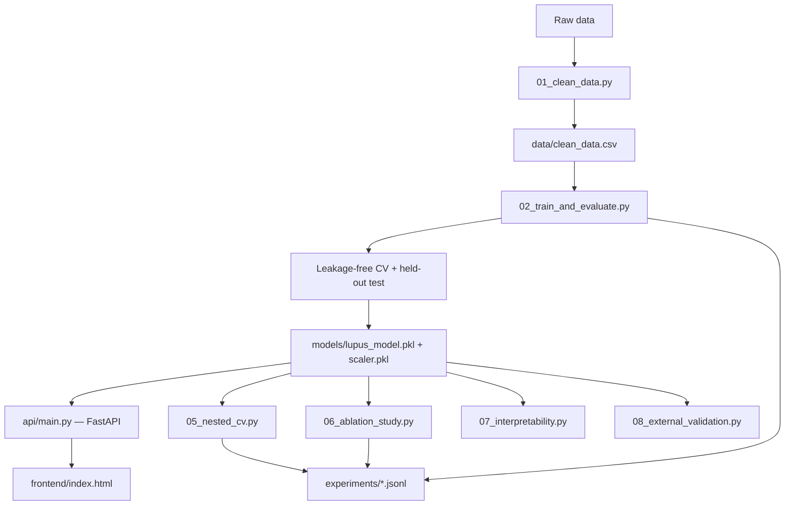

# An Interpretable Four-Gene ML Framework for SLE Classification

A binary classifier that predicts Systemic Lupus Erythematosus (SLE) status
from the expression levels of four interferon-stimulated genes (ISGs):
**IFIT3, IFIH1, CXCL10, STAT2**.

## 1. Research question

> Can a four-gene interferon signature (IFIT3, IFIH1, CXCL10, STAT2) provide
> robust, interpretable, and leakage-free classification of SLE within a
> single cohort — and how much of that signal comes from redundancy across
> the four co-regulated genes versus any one of them individually?

This project answers the second half of that question directly (see
§9 Ablation study) and is explicit about what it *cannot* yet answer: whether
the classifier generalizes to an independent cohort (§10).

## 2. Why these biomarkers

SLE is strongly associated with elevated **Type I interferon signaling**.
IFIT3, IFIH1, CXCL10, and STAT2 are all canonical members of the
"interferon signature" reported in SLE transcriptomics literature, which is
why they were chosen as model inputs rather than arbitrary genes.

## 3. Dataset

- 210 samples, 105 SLE / 105 Healthy after cleaning.
- Original file had two data-quality issues, fixed in `src/01_clean_data.py`:
  - The `Label` column mixed `"Healthy"` and `"healthy"` as if they were
    different classes — normalized to two canonical labels.
  - The `Sample ID` column was empty for ~95% of rows and was dropped (it
    was never used as a model feature).
- A lightweight data-version manifest (`data/DATA_VERSION.json`, a SHA-256
  hash + row counts) is regenerated on every training run — see
  [`DATA_VERSIONING.md`](DATA_VERSIONING.md) for why this is used instead of
  DVC, and how to migrate if the project grows.

## 4. Experimental protocol

- Stratified 80/20 train/test split. The `StandardScaler` used for the
  held-out test set and the deployed model is fit **only on the training
  set**.
- Cross-validation uses `Pipeline(StandardScaler, model)` so the scaler is
  refit **inside each fold** — a validation fold's statistics never leak
  into scaling, even during CV. (An earlier version of this script fit the
  scaler once on the whole training set before CV — a mild leakage that
  inflated CV scores. Fixed; see git history / `src/02_train_and_evaluate.py`
  docstring.)
- Nested cross-validation (`src/05_nested_cv.py`) additionally separates
  hyperparameter selection (inner 3-fold `GridSearchCV`) from performance
  estimation (outer 5-fold), so tuning can't inflate the reported score.
- Every run appends a record — model, hyperparameters, CV/test scores,
  dataset hash, timestamp — to `experiments/*.jsonl`. See
  [`DATA_VERSIONING.md`](DATA_VERSIONING.md) for the format.

## 5. Models compared

Three model families, compared on the held-out test set:
Logistic Regression, Random Forest, and an RBF-kernel SVM
(`src/02_train_and_evaluate.py`).

**Final model: Logistic Regression** — chosen over the other two for
interpretability (a clinician/reviewer can read the coefficients
directly), which matters more than a marginal accuracy gain in a medical
context. All three families score identically on this dataset (see §6), so
this choice costs nothing in raw performance.

## 6. Results

| Model | Accuracy | Precision | Sensitivity | Specificity | F1 | ROC-AUC | PR-AUC | Brier | 5-fold CV ROC-AUC |
|---|---|---|---|---|---|---|---|---|---|
| Logistic Regression | 1.00 | 1.00 | 1.00 | 1.00 | 1.00 | 1.00 | 1.00 | ~0.00 | 1.00 ± 0.00 |
| Random Forest | 1.00 | 1.00 | 1.00 | 1.00 | 1.00 | 1.00 | 1.00 | 0.00 | 1.00 ± 0.00 |
| SVM (RBF) | 1.00 | 1.00 | 1.00 | 1.00 | 1.00 | 1.00 | 1.00 | ~0.00 | 1.00 ± 0.00 |

Full numbers: `models/metrics_report.json`. Nested CV results (outer 5-fold,
inner 3-fold hyperparameter search): `experiments/experiment_log.jsonl`
(filter `script == "05_nested_cv.py"`) — they agree with the simpler CV
above, which is expected on data this separable (see §7).


## 7. Statistical uncertainty

95% confidence intervals on the test-set metrics via bootstrap resampling
(`src/04_bootstrap_ci.py`, 2000 resamples): all intervals are essentially
`[1.00, 1.00]`. **This tightness reflects consistency on this specific,
cleanly-separated dataset — not proof of generalization to new cohorts.**
A tight CI here is a data-separability artifact, not evidence of clinical
readiness; see §10.


The calibration curve above is included for completeness (Brier score,
reliability diagram) even though, on data this separable, it's necessarily
uninformative — every predicted probability clusters near 0 or 1. Calibration
becomes a meaningful check once probabilities span the middle of the range,
which needs noisier, more realistic data than this dataset provides.

## 8. Interpretability

Feature importance (Logistic Regression coefficients on standardized
inputs) — all four genes contribute roughly equally, consistent with them
being co-regulated members of the same interferon pathway:


Three additional views, generated by `src/07_interpretability.py`:

- **Coefficient stability** — bootstrap 95% CIs on each coefficient across
  1000 resamples (`figures/coefficient_bootstrap_ci.png`): all four
  coefficients are tightly and consistently positive, i.e., not an artifact
  of a single lucky train/test split.
- **Permutation importance** — a model-agnostic cross-check on the held-out
  test set (`figures/permutation_importance.png`). On this dataset it comes
  out near-zero for every feature, because any single gene alone already
  separates the classes (§9) — shuffling one feature doesn't hurt ROC-AUC
  when the other three still carry full separating signal.
- **Partial dependence** — how predicted P(SLE) moves as each gene varies,
  holding the others at their mean (`figures/partial_dependence.png`).

## 9. Ablation study

`src/06_ablation_study.py` evaluates the same leakage-free CV protocol on
all 15 non-empty subsets of the 4 genes (4 singles, 6 pairs, 4 triples, the
full model). Full table: `experiments/ablation_results.csv`; plot:


**Finding:** every single gene alone achieves the same CV ROC-AUC (1.00) as
the full 4-gene model, on this dataset. That's a direct consequence of the
same fact noted in §3/§11 — the classes don't overlap on *any* individual
feature here — so it should be read as a property of this dataset's
separability, not as evidence that three of the four genes are redundant
biomarkers in general. On noisier, real-world expression data the genes
would be expected to contribute more unevenly.

## 10. External validation

**Status: not available.** No independent external cohort exists for this
project. `src/08_external_validation.py` is infrastructure for the moment
one does — `python src/08_external_validation.py --data cohort.csv` runs
the full evaluation and writes an experiment log entry, without needing any
code changes. This is, by a wide margin, the single most important
uninstalled piece of validation for this project: everything else in this
README is an internal-validation result until this step happens.

## 11. Limitations (read before quoting the accuracy number)

**The perfect scores above are a property of this dataset, not proof that
the model is clinically ready.** As the boxplots show, there is **no
overlap at all** between the SLE and Healthy groups on any of the four
genes — every SLE sample has higher expression than every Healthy sample.
Real clinical gene-expression data is noisier than this in practice; a
dataset this cleanly separable is more typical of a curated teaching
dataset than of raw patient data pulled from a live cohort. I'm stating
this explicitly rather than presenting 100% accuracy as a finished,
clinically validated result:

- No independent external cohort exists yet to confirm the model
  generalizes beyond this dataset's collection conditions (§10).
- 210 samples is workable for a 4-feature linear model, but small for
  drawing conclusions about a heterogeneous disease like SLE, which has
  many known subtypes and comorbidities not represented here.
- No demographic data (age, sex, ethnicity) was available, so subgroup
  fairness is untested — see `MODEL_CARD.md` → Ethical Considerations.
- This project demonstrates a correct ML methodology (clean data, no
  leakage, proper train/test separation, nested CV, ablation,
  interpretability, calibration reporting) applied to a public-style
  biomarker dataset — it is a portfolio/research-methods project, not a
  diagnostic tool.

## 12. Responsible AI / deployment behavior

- The API and frontend both surface a **model score**, not a labeled
  "probability" — wording matters here, and both explicitly disclaim that
  this is not a clinical probability.
- Every API prediction is checked for **out-of-distribution inputs**: if
  any feature is more than 3 standard deviations from the training-set
  mean, the response flags `out_of_distribution: true` rather than
  returning a confident-looking number for an input the model has never
  seen anything like. The frontend surfaces this as a visible warning.
- Full model card, including intended use, out-of-scope use, and ethical
  considerations: [`MODEL_CARD.md`](MODEL_CARD.md).

## 13. Reproducibility

```bash
pip install -r requirements.txt

cd src
# Optional — only if you have the raw file; see data/raw/README.md
python 01_clean_data.py

python 02_train_and_evaluate.py   # trains, evaluates, saves model + calibration plot
python 03_visualize.py            # regenerates figures
python 04_bootstrap_ci.py         # 95% CIs via bootstrap
python 05_nested_cv.py            # nested CV
python 06_ablation_study.py       # feature-subset ablation
python 07_interpretability.py     # coefficient CIs, permutation importance, PDP
python 08_external_validation.py --data path/to/cohort.csv   # once available
```

Run the API locally:

```bash
uvicorn api.main:app --reload
# then open http://127.0.0.1:8000/docs
```

Run tests:

```bash
pytest tests/ -v
```

Code quality tooling (`pyproject.toml`, `.pre-commit-config.yaml`):

```bash
black --check src/ api/ tests/
ruff check src/ api/ tests/
mypy src/ api/
pre-commit install   # runs the three above automatically on every commit
```

## 14. Architecture



## 15. Repository structure

```
lupus_project/
├── data/
│   ├── raw/                     # not committed — see data/raw/README.md
│   ├── clean_data.csv           # cleaned dataset (committed)
│   └── DATA_VERSION.json        # regenerated hash/row-count manifest
├── models/
│   ├── lupus_model.pkl          # trained LogisticRegression (joblib)
│   ├── scaler.pkl               # StandardScaler fit on the training split
│   └── metrics_report.json      # full metrics for all 3 models compared
├── experiments/
│   ├── experiment_log.jsonl     # every training run, appended
│   ├── ablation_results.csv
│   └── ablation_log.jsonl
├── figures/
│   ├── feature_boxplots.png
│   ├── correlation_heatmap.png
│   ├── feature_importance.png
│   ├── calibration_curve.png
│   ├── coefficient_bootstrap_ci.png
│   ├── permutation_importance.png
│   ├── partial_dependence.png
│   └── ablation_study.png
├── src/
│   ├── utils.py                 # shared paths, data hashing, experiment logging
│   ├── 01_clean_data.py
│   ├── 02_train_and_evaluate.py
│   ├── 03_visualize.py
│   ├── 04_bootstrap_ci.py
│   ├── 05_nested_cv.py
│   ├── 06_ablation_study.py
│   ├── 07_interpretability.py
│   └── 08_external_validation.py
├── api/
│   └── main.py                  # FastAPI service
├── frontend/
│   └── index.html
├── tests/
│   ├── test_pipeline.py
│   └── test_api.py
├── .github/workflows/ci.yml     # lint + type-check + full pipeline + tests
├── pyproject.toml               # black / ruff / mypy / pytest config
├── .pre-commit-config.yaml
├── Dockerfile
├── MODEL_CARD.md
├── DATA_VERSIONING.md
└── README.md
```

## 16. Future work

- Replace §10's placeholder with a real independent cohort once one is
  available — this is the highest-value next step by a wide margin.
- Re-run the ablation study (§9) on a noisier, more realistic dataset to
  see whether the four genes actually contribute unevenly once the
  artificial perfect separability is gone.
- Subgroup fairness evaluation once demographic data is available.
- A short paper writeup (abstract → methods → results → limitations) is a
  natural next step once §10 has a real result to report — intentionally
  out of scope for this iteration.

# 17. Research AI Platform v2 additions

This version adds four production-style architecture layers around the original SLE classifier:

### Explainable AI / XAI
`POST /predict` now returns local feature contributions for IFIT3, IFIH1, CXCL10 and STAT2. The API uses SHAP's linear explainer when available and falls back to the exact linear contribution `x_j * beta_j` for this logistic model. The Next.js dashboard renders the contributions as an interactive local explanation panel.

### Multimodal AI
`clinical_notes` is accepted by `/predict`. A TF-IDF + logistic regression NLP branch is fused with the biomarker model using a transparent 70/30 research weighting. Because this repository has no real labeled clinical-note dataset, `src/09_build_multimodal_note_model.py` trains on clearly labeled synthetic templates. This is an architecture demo, not a clinical NLP result.

### MLOps / Data Drift
Every inference is logged to `monitoring/inference_log.jsonl`. `/monitor/drift` compares the current inference batch against the training distribution using PSI and a two-sample KS test. PSI >= 0.20 or KS p < 0.01 raises a retraining-review alert. This is a triage signal, not proof of model failure.

### Edge AI / Privacy
`scripts/export_onnx.py` exports the scaler + logistic model to `models/model.onnx`. The dashboard contains `onnxruntime-web` client-side inference so the four biomarker values can be evaluated in-browser without sending them to the API. The shipped ONNX artifact uses a small pure-protobuf fallback when `skl2onnx` is unavailable at build time; if `skl2onnx` is installed, the script emits a standard `skl2onnx` export instead.

## 18. Run

### API
```bash
pip install -r requirements.txt
uvicorn api.main:app --reload
```

### Dashboard
```bash
cd frontend
npm install
npm run dev
```

Optionally set `NEXT_PUBLIC_API_URL` to the deployed FastAPI URL before building the dashboard.

## 19. New files

```text
src/09_build_multimodal_note_model.py
scripts/export_onnx.py
monitoring/README.md
models/clinical_note_model.pkl
models/clinical_note_vectorizer.pkl
models/multimodal_fusion.json
models/model.onnx
frontend/app/*
frontend/lib/edgeModel.ts
frontend/public/model.onnx
```

The clinical disclaimer remains intentionally prominent: this is a research/portfolio system and has not been clinically validated.


## 2.1 Platform upgrades

The current platform extends the earlier XAI/multimodal/MLOps prototype with production-oriented controls:

- **Multimodal Edge AI:** biomarker inference uses the browser ONNX runtime while the clinical-note model and fusion calculation run locally from a bundled parameter manifest. The default frontend path does not send note text to the API.
- **Reliability layer:** reports OOD status, a reliability tier, and a deterministic sensitivity-based uncertainty band. The band is explicitly not a statistical confidence interval.
- **Counterfactual/sensitivity simulator:** tests controlled feature perturbations and labels the result as sensitivity analysis, not causal inference.
- **Human-in-the-loop review:** accepts/overrides/marks a demo result uncertain and stores review events without requiring patient identifiers.
- **Timeline playground:** visualizes a local longitudinal trajectory from demo snapshots without claiming a clinical progression model.
- **Model governance:** versioned model registry, audit manifest, drift status, and retraining-review signals.

### Privacy architecture

The UI defaults to client-side multimodal inference. The API remains available for server-side evaluation, monitoring, and governance workflows. No real patient identifiers are required by the demo.

### Important limitation

The included clinical-note model is trained on synthetic templates. The tabular dataset is small and the observed benchmark metrics are perfect/separable; these results are not clinical validation and should not be presented as such.
